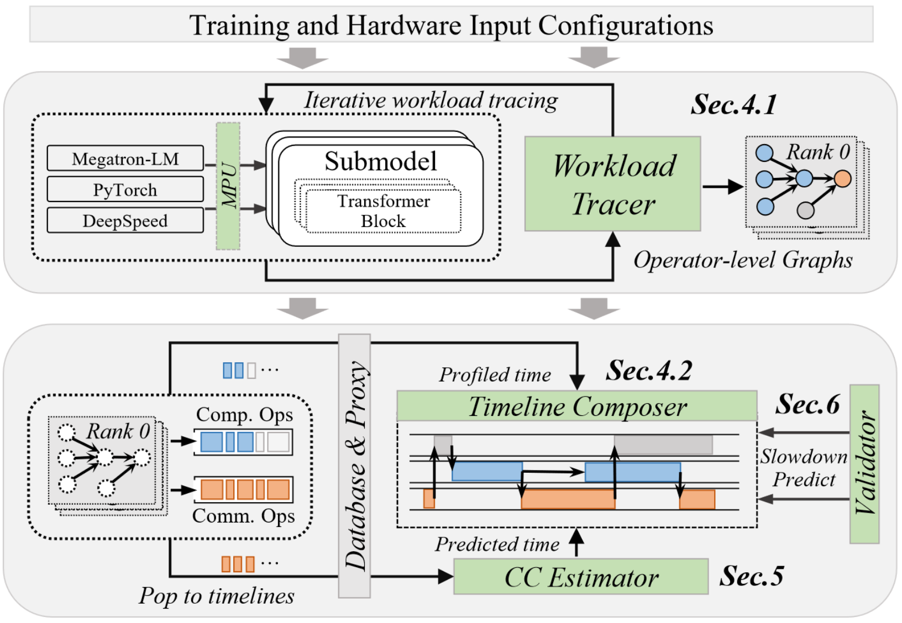

# Echo Overview

Echo is a simulation platform designed for distributed training of machine learning and LLMs. It helps researchers and engineers evaluate training scenarios, parallelism strategies, and hardware configurations without deploying on large physical clusters.



## Plan

We will gradually release Echo's core components to the community.

Currently, we have published the slowdown module. This module predicts GPU kernel performance slowdowns due to comp.-comm. overlap during distributed training. It provides tools for kernel metric collection, slowdown data generation, and training/testing prediction models.


## Citation

If you use this repo in your research, please cite our paper:

```bibtex
@article{echo2024,
  title={Echo: Simulating Distributed Training At Scale},
  author={Yicheng Feng, Yuetao Chen, Kaiwen Chen, Jingzong Li, Tianyuan Wu, Peng Cheng, Chuan Wu, Wei Wang, Tsung-Yi Ho, Hong Xu},
  journal={arXiv preprint arXiv:2412.12487},
  year={2024}
}
```

## Contact

Email Yicheng Feng (<yichengfeng@link.cuhk.edu.hk>) or Eric, Kin Hang Sew (<ericskh@link.cuhk.edu.hk>) if you have any questions.

## License

This project is licensed under the MIT license - see the [LICENSE](LICENSE) file for details.
