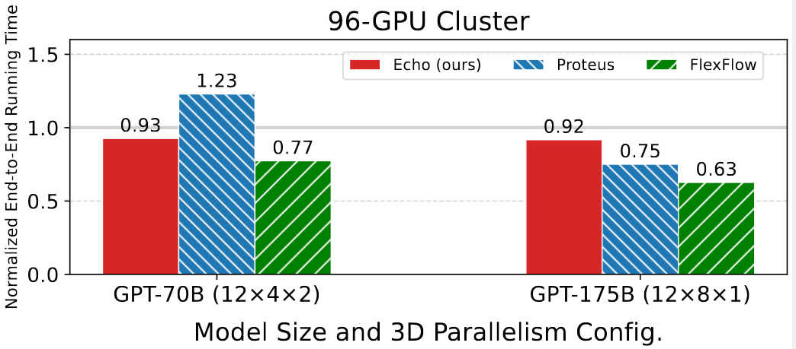

## Lastest News🎯
📍[2025/05] We release some NCCL-test logs from hundreds of GPUs in the repo.

📍[2025/05] Echo tracer module (v0.5) has been released. This version brings the following features:

- **PyTorch Support**: Comprehensive tracing for PyTorch models, including:
  - Support for HuggingFace Transformers models
  - Support for libs (e.g., transformers, torchvision) models and custom PyTorch models
  - Support training parallel mode like DDP
  - Capturing both forward and backward passes and extracting execution graphs and runtime data


📍[2025/03] Echo slowdown module (v1.0) has been released. This version brings the following features:

- **Kernel Metric Collection**
  - Utilizes NVIDIA Nsight Compute and Nsight Systems to automatically profile GPU kernels
  - Captures detailed execution metrics
  - Generates baseline performance profiles for isolated kernel execution
  - Outputs structured JSON files containing raw kernel metrics

- **Slowdown Collection**
  - Analyzes kernel behavior under various overlap scenarios
  - Measures actual slowdown factors through controlled experiments
  - Generates ground truth data for model training and validation

- **Training & Testing**
  - Implements machine learning models for slowdown prediction
  - Provides comprehensive evaluation metrics


# Echo Overview

Echo is a simulation platform designed for distributed training of machine learning and LLMs. It helps researchers and engineers evaluate training scenarios, parallelism strategies, and hardware configurations without deploying on large physical clusters.

<div style="text-align: center;">
    
</div>

### Key Features:

- **Support for 3D Parallelism**: Echo accurately simulates data parallelism (DP), tensor parallelism (TP), and pipeline parallelism (PP) to reflect real-world large-scale training.
- **Workload Tracer**: Echo traces runtime execution graphs in an ex-situ manner, allowing a single device to simulate thousands of GPUs, without requiring a full-scale deployment.
- **Communication-Overlap Estimation**: Echo introduces a slowdown predictor to model performance degradation caused by overlapping computation and communication, improving accuracy in simulation.


### E2E Results:
We evaluated Echo’s end-to-end performance on a 96-GPU H800 cluster. Echo achieves an average accuracy of 92% in training step time while completing the simulation in under 2 minutes.




## Plan

We will gradually release Echo's core components to the community.

Currently, we have published the [**slowdown module**](https://github.com/NetX-lab/Echo-slowdown/tree/18b723021da83759b72b3434b9471987c14e5c4c). This module predicts GPU kernel performance slowdowns due to comp.-comm. overlap during distributed training. It provides tools for kernel metric collection, slowdown data generation, and training/testing prediction models.


We are actively developing new features and plan to support:

- **Expert Parallelism (EP)** for **Mixture of Experts (MoE)** models.
- **Context Parallelism (CP)** to optimize long-sequence training.
- **Visualization and analysis tool**  for visualizing and analyzing all events across different GPUs/ranks.
- **Expanded NCCL communication modeling** to enhance network simulation accuracy by incorporating more complex factors such as congestion control, adaptive routing, and bandwidth contention.
- **Support for diverse hardware backends**, including future NVIDIA and AMD architectures.


## Citation

If you use this repo in your research, please cite our paper:

```bibtex
@article{echo2024,
  title={Echo: Simulating Distributed Training At Scale},
  author={Yicheng Feng, Yuetao Chen, Kaiwen Chen, Jingzong Li, Tianyuan Wu, Peng Cheng, Chuan Wu, Wei Wang, Tsung-Yi Ho, Hong Xu},
  journal={arXiv preprint arXiv:2412.12487},
  year={2024}
}
```

## Contact

Special thanks to [Kin Hang Sew](https://github.com/ericskh2) for contributions in organizing and open-sourcing this project.

Email Yicheng Feng (<yichengfeng@link.cuhk.edu.hk>) or Eric, Kin Hang Sew (<ericskh@link.cuhk.edu.hk>) if you have any questions.

Welcome to join the Echo community chat groups.

<div style="text-align: left;">
    
</div>


## License

This project is licensed under the MIT license - see the [LICENSE](LICENSE) file for details.
